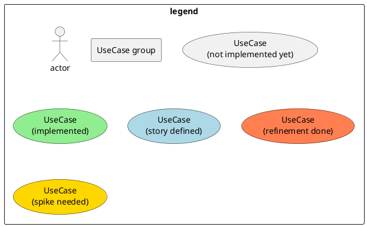
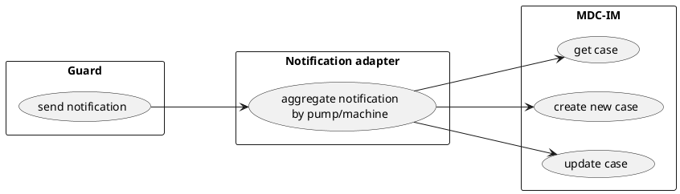
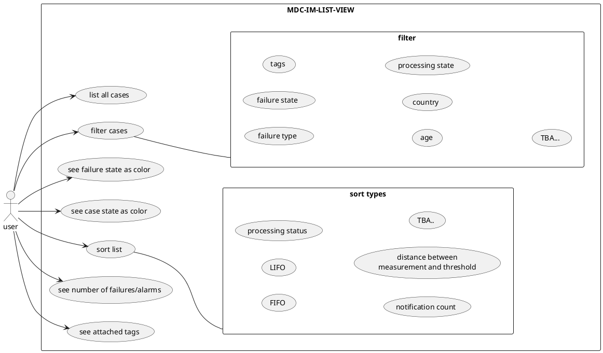

<details>
  <summary>info and legend</summary>
To display the uml diagrams:
Intenics Private PlantUML Server: https://puml.intenics.io/svg/

**! ONLY use our (or your own) private PlantUML Server !**

Chrome extension:https://chrome.google.com/webstore/detail/pegmatite/jegkfbnfbfnohncpcfcimepibmhlkldo

VSCode: https://marketplace.visualstudio.com/items?itemName=jebbs.plantuml

Intellij: https://plugins.jetbrains.com/plugin/7017-plantuml-integration



</details>

## New Notification



## Case List


## List Actions
```plantuml
left to right direction
actor user
rectangle "MDC-IM-LIST-VIEW"{
    usecase "select entry" as mdc_im_select
    usecase "unselect entry" as mdc_im_unselect
    usecase "select all entries" as mdc_im_select_all
    usecase "unselect all entries" as mdc_im_unselect_all
    usecase "paginate" as mdc_im_paginate
    usecase "set pagination size" as mdc_im_pagination_size
    user --> mdc_im_select
    user --> mdc_im_unselect
    user --> mdc_im_select_all
    user --> mdc_im_unselect_all
    user --> mdc_im_paginate
    user --> mdc_im_pagination_size
}
```

## Case details
### information
```plantuml
left to right direction
actor user
rectangle "MDC-IM-DETAIL-VIEW"{
    usecase "display case overview data" as mdc_im_overview
    usecase "display vibration data chart" as mdc_im_show_vibration
    note right
        maybe, not sure
        if still needed
    end note
    usecase "display pump picture" as mdc_im_show_pump_image
    usecase "display maintenance entries" as mdc_im_maintenance_entries
    usecase "display history of changes" as mdc_im_history
    usecase "display technical data of pump" as mdc_im_technical_data 
}
rectangle MDC {
    usecase "get maintenance entries" as mdc_get_maintenances  #lightgreen
    usecase "get picture URL" as mdc_get_picture_url #lightgreen
    usecase "get pump details" as mdc_get_pump_details #lightgreen
    
}
rectangle GUARD {
    usecase "get picture URL" as gu_pre_signed #lightgreen
}
mdc_im_maintenance_entries--->mdc_get_maintenances
mdc_im_show_pump_image--->mdc_get_picture_url
mdc_get_picture_url-r->gu_pre_signed
mdc_im_technical_data--->mdc_get_pump_details
user-->mdc_im_overview
user-->mdc_im_show_vibration
user-->mdc_im_show_pump_image
user-->mdc_im_maintenance_entries
user-->mdc_im_history
user-->mdc_im_technical_data

```

### additional information - URLS

```plantuml
left to right direction
actor user

rectangle "MDC-IM-DETAIL-VIEW"{
    
    rectangle "URLs" {
        usecase "add url to case" as mdc_im_add_url
        usecase "show urls" as mdc_im_show_urls
        usecase "edit url" as mdc_im_edit_url
        usecase "delete url" as mdc_im_delete_url
    }
}

rectangle "Notification adapter" as adapter{
    usecase "create MDC URL from event data" as ada_create_mdc_url
    note right
        what happens on
        following notifications?
        set mdc link to the
        latest date?
    end note
    usecase "create C4C Equipment URL from event data" as ada_create_c4c_equip_url
    usecase "create C4C Organization URL from event data" as ada_create_c4c_orga_url
}

rectangle "C4C" as c4c{
    usecase "lookup equipment" as c4c_lookup_equip
    usecase "lookup organization" as c4c_lookup_orga
}
note right of c4c
    possible apis unclear
end note


user --> mdc_im_add_url
user --> mdc_im_show_urls
user --> mdc_im_edit_url
user --> mdc_im_delete_url

c4c_lookup_equip <-- ada_create_c4c_equip_url
c4c_lookup_orga <-- ada_create_c4c_orga_url
mdc_im_add_url <-- ada_create_mdc_url
mdc_im_edit_url <-- ada_create_mdc_url
mdc_im_add_url <-- ada_create_c4c_equip_url
mdc_im_add_url <-- ada_create_c4c_orga_url

```

### additional information - notes

```plantuml
left to right direction
actor user

rectangle "MDC-IM-DETAIL-VIEW"{
    rectangle "notes" {
        usecase "add note to case" as mdc_im_add_note
        usecase "show notes" as mdc_im_show_notes
        usecase "edit notes" as mdc_im_edit_notes
        usecase "delete notes" as mdc_im_delete_notes
    }
   
}

user --> mdc_im_add_note
user --> mdc_im_show_notes
user --> mdc_im_edit_notes
user --> mdc_im_delete_notes

```

### additional information - attachments

```plantuml
left to right direction
actor user

rectangle "MDC-IM-DETAIL-VIEW"{

    rectangle "attachment" {
        usecase "add attachment to case" as mdc_im_add_attachment
        usecase "download attachments" as mdc_im_download_attachments
        usecase "edit attachments" as mdc_im_edit_attachments
        usecase "delete attachments" as mdc_im_delete_attachment
    }
  
}


user --> mdc_im_add_attachment
user --> mdc_im_download_attachments
user --> mdc_im_edit_attachments
user --> mdc_im_delete_attachment


```

### marking & assignments
```plantuml
left to right direction
actor user
rectangle "MDC-IM-DETAIL-VIEW"{
    usecase "mark case as closed" as mdc_im_close
    usecase "assign case to user" as mdc_im_assign
    usecase "mark case as important" as mdc_im_important
    usecase "add existing tag to case" as mdc_im_add_tag
    usecase "create new tag" as mdc_im_create_tag
    usecase "add new tag to case" as mdc_im_add_new_tag
    mdc_im_add_new_tag ..> mdc_im_create_tag: <<extend>>
    usecase "mark as one time occurrence" as mdc_im_one_time_occ
    note right
        possibly not needed
        with "ignore until" or
        "follow-up" feature
    end note
    user-->mdc_im_close
    user-->mdc_im_assign
    user-->mdc_im_important
    user-->mdc_im_add_tag
    user-->mdc_im_create_tag
    user-->mdc_im_add_new_tag
    user-->mdc_im_one_time_occ
}
```

### mute and resubmission
```plantuml
left to right direction
actor user
rectangle "MDC-IM-DETAIL-VIEW"{
    usecase "mute case until [date]" as mdc_im_mute_until
    usecase "mute case" as mdc_im_mute
    usecase "un-mute case" as mdc_im_unmute
    usecase "resubmission on [date]" as mdc_im_resubmission
    
}
user-->mdc_im_mute_until
user-->mdc_im_mute
user-->mdc_im_unmute
user-->mdc_im_resubmission

```

### MDC & C4C Interaction
```plantuml
left to right direction
actor user

rectangle "MDC-IM-DETAIL-VIEW"{
 usecase "redirect to MDC [automatic preconfigured]" as mdc_im_redirect_mdc
 usecase "update redirection URL"
}
```

## Condition analysis
```plantuml
left to right direction
actor user
rectangle "MDC-IM-DETAIL-VIEW"{
    usecase "create condition analysis from template" as mdc_im_create_analysis
    usecase "download condition analysis" as mdc_im_download_analysis
}
rectangle "GUARD" {
    usecase "download parametrized graph" as gu_download_graph
    note left
         practicality/doablility unclear
    end note
}
user-->mdc_im_download_analysis
user-->mdc_im_create_analysis
mdc_im_create_analysis-->gu_download_graph
```